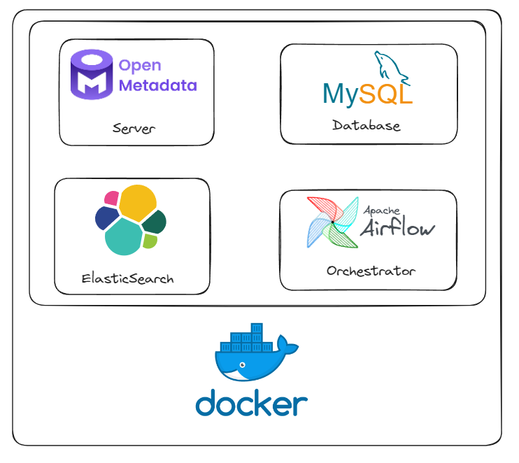
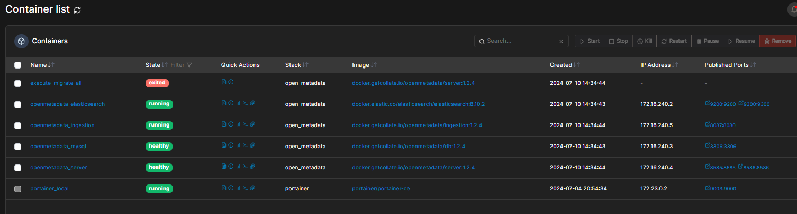
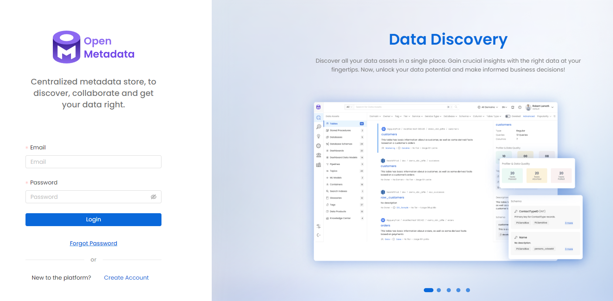

# Catálogo de dados com Open Metadata

## Arquitetura


## Pré-requisitos
* Docker

## Como desbloquear os pré-requisitos?
### Instalação do Docker
https://www.youtube.com/playlist?list=PLbPvnlmz6e_L_3Zw_fGtMcMY0eAOZnN-H

## Como baixar as imagens e rodar os containers?
### Clone o repositório do projeto
```
git clone https://github.com/wlcamargo/open_metadata.git
```

### Acesse a pasta do projeto
```
cd open_metadata
```

### Baixe as imagens e rode os containers
```
sudo docker compose up -d
```

Sample containers running:


## Como acessar os serviços?
### Links e credenciais
#### Open Metadata Server

localhost:8585

```
Login: admin
Senha: admin
```

Sample Open Metadata Server:


#### Airflow

localhost:8087

```
Login: admin
Senha: admin
```

## Conclusão
Parabéns! Seu catálogo de dados está pronto para o uso

## Tutoriais
### Versionamento de metadados
https://youtu.be/Q3n6mxaX_zY

### Mascarando dados sensíveis
https://youtu.be/1cvqmWLMMj4

### Catalogando dados do Postgres + Kafka
https://youtu.be/eYksqEEbiIQ

## Referências
https://docs.open-metadata.org/v1.4.x

## Developer
| Desenvolvedor      | LinkedIn                                   | Email                        | Portfólio                              |
|--------------------|--------------------------------------------|------------------------------|----------------------------------------|
| Wallace Camargo    | [LinkedIn](https://www.linkedin.com/in/wallace-camargo-35b615171/) | wallacecpdg@gmail.com        | [Portfólio](https://wlcamargo.github.io/)   |